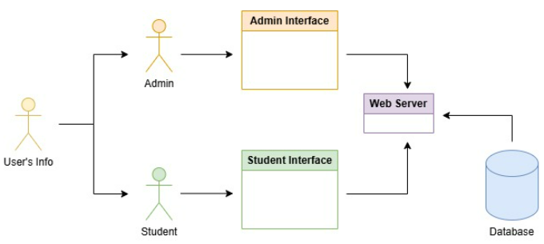

# CSDS393-Project: Stellic Chatbot
## Description
        The Stellic Chatbot is a web application that assists users at Case Western Reserve University with academic scheduling. 
        It manages a student’s current academic process, degree requirements, courses taken, and classes offered at CWRU during the specified semesters. 
        The chatbot also provides AI functionality, allowing users to interact with it and obtain necessary information efficiently and effectively.
## Architecture

## Install Requirements
Install the required python packages:
```shell
pip install -r requirements.txt
```
## Usage
### As a Student
1. Run the software on a website
2. Login using your `name`, `Case ID`, and select your `major` with the dropdown menu
3. After login, you can
  * Access the chatbot with the `chat` functionality on the top left corner of the software and ask any question regarding `major requirements` and `courses`
  * Use the search bar to search for `courses`
### As an Admin
1. Run the software on a website
2. Login using your `name` and `Case ID`
3. After login, you can
  * Access the chatbot with the `chat` functionality on the top left corner of the software and ask any question regarding `major requirements` and `courses`
  * Create and add `courses` into the database
## Folder Structure Overview
- `AI/` - AI utility scripts
- `scrape/` - Scripts related to scraping
- `static/` - Static assets for the web (JS)
- `templates/` - HTML templates for frontend
- `tests/` - Testing files
## Tech Stacks/Dependencies
- **Backend**
  - python
  - Flask
- **Frontend**
  - HTML
  - JavaScript
- **Database**
  - MongoDB
- **AI Engine**
  - Llama with Groq (RAG)
  - Sentence Transformers (Embeddings)
- **Scraping**
  - Selenium
## Contribution
**Aidan Bugayong:** 
- RAG chatbot
- Frontend/Flask

**Brandon Lee:**
- Course/Degree Scraping
- Course Search

**Natalie Lee:**
- Unit Testing
- Frontend/Flask

**Sam Lin:**
- Database Management
- Admin Account
## Development Retrospective
- **Time Constraints for Scheduling Functionality**
  - We originally planned to implement a course scheduling feature. However, due to limited development time and the complexity of scraping reliable scheduling data, we had to deprioritize this functionality.  
  *→ Future improvement*: Integrating APIs (if available) or using static sample schedule data could help in future iterations.
- **Difficulty Implementing Vector Search**
  - Integrating a working vector search was technically challenging and more complex and took more time than we anticipated.  
  *→ Future improvement*: Start with simpler keyword search first, then progressively move to vector models to ensure a working prototype earlier. 
## License
This project is licensed under the [MIT License](LICENSE).
## Github URL
[Click here to view the GitHub project](https://github.com/Extr1n/CSDS393-Project)